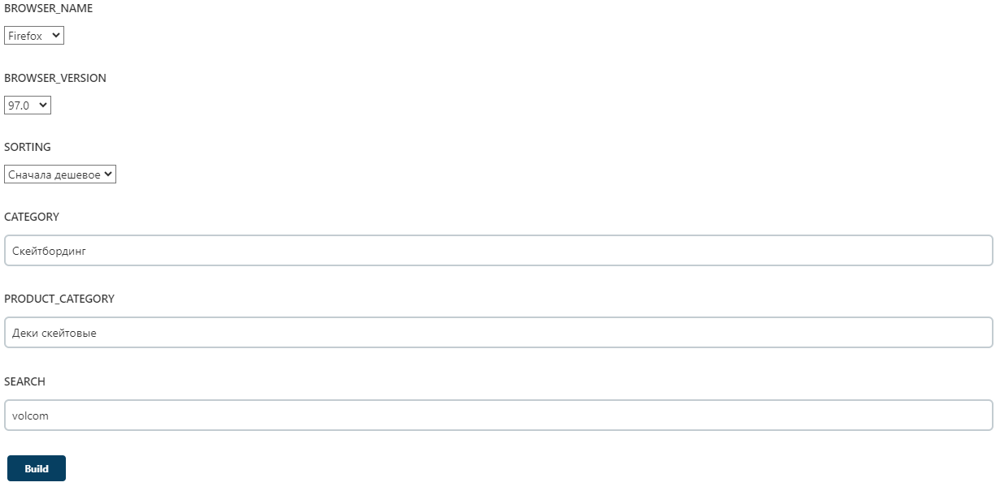
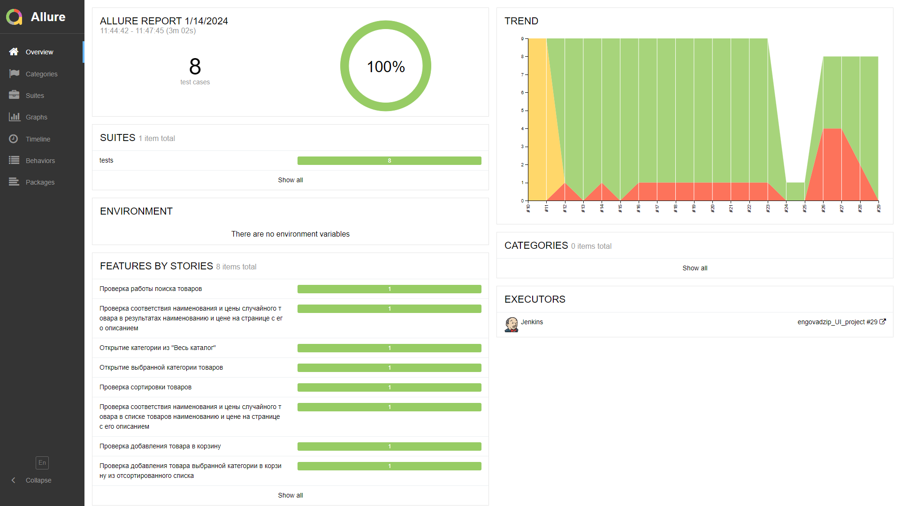

<h1 align="center">"SKVOT" BOARDSHOP UI TESTING PROJECT</h1>  
<p align="center">
    <a href="https://www.skvot.com/">
        
    </a>
</p>

<h2 align="center">Used stack</h2>
<p align="center">
    <a href="https://www.atlassian.com/software/jira/">
        
    </a>
    <a href="https://www.python.org/">
        
    </a>
    <a href="https://www.jetbrains.com/pycharm/">
        
    </a>
    <a href="https://www.selenium.dev/documentation/webdriver/">
        
    </a>
    <a href="https://docs.pytest.org/">
        
    </a>
    <a href="https://git-scm.com/">
        
    </a>
    <a href="https://www.jenkins.io/">
        
    </a>
    <a href="https://aerokube.com/selenoid/">
        
    </a>
    <a href="https://allurereport.org/">
        
    </a>
    <a href="https://qameta.io/">
        
    </a>
    <a href="https://telegram.org/">
        
    </a>
</p>  

<h2 align="center">Content</h2>  

* [Description](#description)  
* [Tests launch](#tests-launch)  
    * [Local launch](#local-launch)  
        * [Preparing the environment](#preparing-the-environment)  
        * [Launch](#launch)  
        * [Generating a test report](#generating-a-test-report)  
        * [Tests options](#tests-options)  
            * [Options conflicts](#options-conflicts)  
    * [Launch using Jenkins](#launch-using-jenkins)  
* [Tests results](#tests-results)  
    * [TestOps report](#testops-report)  
    * [Allure report](#allure-report)  
    * [Telegram notification](#telegram-notification)
    * [Integration with Jira](#integration-with-jira) 

## Description

Tests are developed using [Python](https://www.python.org/) programming language, [Selene](https://github.com/yashaka/selene) and [PyTest](https://docs.pytest.org/) frameworks. Reports are generated by [Allure Report](https://allurereport.org/). Test reports are also sent by [Telegram Bot](https://core.telegram.org/bots) if you launch tests [using Jenkins](#launch-using-jenkins).  
In this project we check the following:  
* Product search.  
* Opening of desired products' category.  
* Sorting of products.  
* Checking that product name and product price in products list are the same as on the product description page.  
* Adding the product to cart.  
* Clearing the cart.  

## Tests launch

### Local launch

#### Preparing the environment

Before launch, you need to install the following (installation guide links are provided):  
* [Google Chrome](https://www.google.com/intl/en_us/chrome/).  
* [Mozilla Firefox](https://mozilla.websoftsoft.com/).  
* [PyCharm](https://www.jetbrains.com/pycharm/).  
* [PyTest](https://docs.pytest.org/en/7.4.x/getting-started.html#install-pytest).  
* [Selene](https://github.com/yashaka/selene?tab=readme-ov-file#installation).  
* [Allure Pytest](https://pypi.org/project/allure-pytest/).  

Also, download the repository with this project on your PC/laptop:  
* Click on "**<> Code**" on the [project page](https://github.com/engovadzip/skvot_boardshop_UI_project).  
* In the opened pop-up menu click on "**Download ZIP**".  
* Download it to preferred directory and unpack downloaded archive there.  

#### Launch

Open any downloaded project's file in PyCharm (right click on file -> Edit with PyCharm). There will be the following window:  
<p align="center">
    
</p>

Click on **Open in Project**. After that there will be a following window:  
<p align="center">
    
</p>

Click on **Trust Project**.  
Open a terminal in the opened PyCharm window by clicking on terminal button. The button locates at the bottom of the left sidebar as shown in the following figure:
<p align="center">
    
</p>
The terminal will open in the bottom of PyCharm as shown in the following figure:
<p align="center">
    
</p>

Launch tests using the following command:  
```
pytest --remote=off
```

After running the command, Google Chrome will open and tests will start. Tests process is provided below:  
<p align="center">
      
</p>  

After the last step of tests (clearing the cart), browser will close. There will be tests result line in terminal when tests will finish. Its example:  
<p align="center">
    
</p>

#### Generating a test report

Tests report is generated by Allure Report. To check it, run the following command after tests:  
```
allure serve allure-results
```  
After that, your system's default browser will open and there will be a [generated report](#allure-report).  

####  Tests options

By default, tests' options:  
* "Volcom" search request.  
* Launch on [Selenoid server](https://selenoid.autotests.cloud/).  
* Google Chrome browser.  
* "Скейтбординг" category.  
* "Деки скейтовые" products' category.  
* "Сначала дешевое" products' sorting.  

Also, you can set the options on tests using the following parameters in command line:  
* ```--search``` sets search request for search checking.
* ```--category``` sets category that will be opened from "Весь каталог".  
* ```--product``` sets products' category that will be selected on products' list page.  
* ```--sort``` sets sorting of products.  
* ```--browser``` sets browser that will be used for tests. There is two options: ```chrome``` or ```firefox```.  
* ```--remote``` sets tests launch locally or on Selenoid server. This mode can be turned on in Jenkins only. You can check tests process on the Selenoid server only.   
* ```--browser_version``` sets browser version on Selenoid server. For Mozilla Firefox there are 97.0 and 98.0 versions. For Google Chrome there are 99.0 and 100.0 versions. By default, browser version is 100.0 for Google Chrome. If you set incorrect browser version, there will be one of the following error messages:  

For Mozilla Firefox:
```
Choose one of the following versions: 97.0 or 98.0.
```  
For Google Chrome:
```
Choose one of the following versions: 99.0 or 100.0.
```  

For example, if you want to open "Сноубординг" category, select "Крепления" products' category, sort by "сначала дорогое" and launch it locally, run the following command in command line:  
```
pytest --remote=on --category="Сноубординг" --product="Крепления для сноуборда" --sort="сначала дорогое" .
```  
Its command's tests process is provided below:  
<p align="center">
      
</p>  

##### Options conflicts

It's OK if you don't set any option from command line because default values are already set (described above). But if you will set conflict options, tests will fail.  

For example, if you set "Скейтбординг" category and "Крепления для сноуборда" products' category. There is no "Крепления" products' category in "Скейтбординг". That's why test will fail.  

### Launch using Jenkins

Open this project on [Jenkins](https://jenkins.autotests.cloud/job/engovadzip_UI_project/). The project's page example is provided below.
<p align="center">
      
</p>  

Click on "**Build with parameters**".  

<p align="center">
      
</p>  

There will be the following parameters on the opened page:  
* **SEARCH** sets search request for search checking.  
* **BROWSER_NAME** sets browser that will be used for tests.   
* **BROWSER_VERSION** sets browser version. For Mozilla Firefox there are 97.0 and 98.0 versions. For Google Chrome there are 99.0 and 100.0 versions.  
* **SORTING** sets sorting of products.  
* **CATEGORY** sets category that will be opened from "Весь каталог".  
* **PRODUCT_CATEGORY** sets products' category that will be selected on products' list page.

**NOTE:** Don't set [conflict options](#options-conflicts)!  
  
The parameters' settings page window is provided below.  
<p align="center">
      
</p>  

Click on "**Build**" button after choosing desired parameters. You will be redirected back on project's page after clicking on "**Build**". There will be a new build below "**Build History**" title as shown in the following figure:  
<p align="center">
      
</p>  

Build's status will change when tests will finish. And there will appear [TestOps](#testops-report) and [Allure](#allure-report) reports as shown in the following figure:  
<p align="center">
      
</p>  


## Tests results

### TestOps report
Go to [Jenkins project's page](https://jenkins.autotests.cloud/job/engovadzip_UI_project/). Click on  in one of successful builds. Tests report is provided below:
<p align="center">
      
</p>  

<p align="center">
      
</p>  

### Allure report

If you generate report locally, follow the [instruction](#generating-a-test-report). If you generate it on Jenkins, click on  in one of successful builds. Tests report from Jenkins is provided below:
<p align="center">
      
</p>  

There will not be **TREND** in the report if you generate report locally. It will be in Jenkins only. 

### Telegram notification

After Jenkins' build will finish, Telegram Bot will send a notification with test results to Telegram chat. The chat is private. It is only for tests developer and responsible members. The notification is provided below:
<p align="center">
      
</p>  

### Integration with Jira
Test results are also available in the corresponding [Jira task](https://jira.autotests.cloud/browse/HOMEWORK-1065) as shown in the following figure:
<p align="center">
      
</p>  