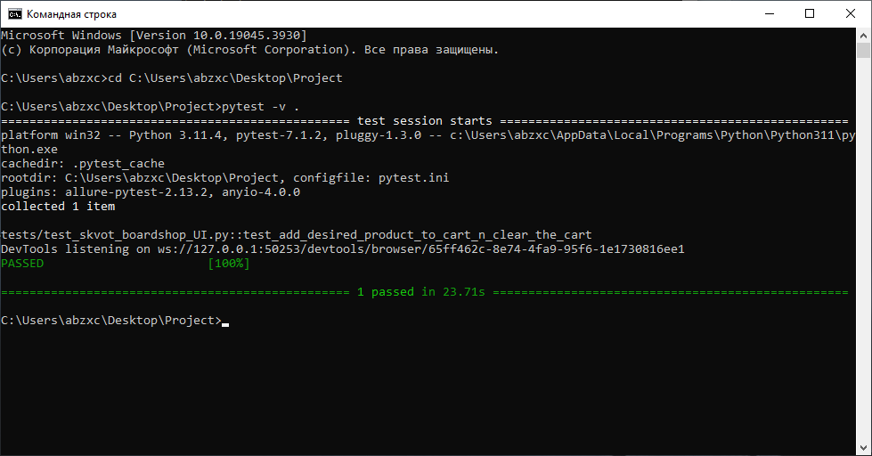

<h1 align="center">"SKVOT" BOARDSHOP UI TESTING PROJECT</h1>  
<p align="center">
    <a href="https://www.skvot.com/">
        
    </a>
</p>

<h2 align="center">Used stack</h2>
<p align="center">
    <a href="https://www.python.org/">
        
    </a>
    <a href="https://www.jetbrains.com/pycharm/">
        
    </a>
    <a href="https://www.selenium.dev/documentation/webdriver/">
        
    </a>
    <a href="https://docs.pytest.org/">
        
    </a>
    <a href="https://git-scm.com/">
        
    </a>
    <a href="https://www.jenkins.io/">
        
    </a>
    <a href="https://aerokube.com/selenoid/">
        
    </a>
    <a href="https://allurereport.org/">
        
    </a>
    <a href="https://qameta.io/">
        
    </a>
    <a href="https://telegram.org/">
        
    </a>
</p>  

## Description
Tests are developed using [Python](https://www.python.org/) programming language, [Selene](https://github.com/yashaka/selene) and [PyTest](https://docs.pytest.org/) frameworks. Reports are generated by [Allure Report](https://allurereport.org/). Test reports are also sent by [Telegram Bot](https://core.telegram.org/bots) if you launch tests [using Jenkins](#launch-using-jenkins-).  
In this project we check the following:  
* Opening of desired products' category.  
* Sorting of products.  
* Checking that product name and product price in products list are the same as on the product description page.  
* Adding the product to cart.  
* Clearing the cart.  

## Tests launch  
### Local launch  
#### Preparing the environment  
Before launch, you need to install the following (installation guide links are provided):  
* [Google Chrome](https://www.google.com/intl/en_us/chrome/).
* [PyCharm](https://www.jetbrains.com/pycharm/).  
* [PyTest](https://docs.pytest.org/en/7.4.x/getting-started.html#install-pytest).  
* [Selene](https://github.com/yashaka/selene?tab=readme-ov-file#installation).
* [Allure Pytest](https://pypi.org/project/allure-pytest/).  

Also, download the repository on your PC/laptop:  
* Click on "**<> Code**" above.  
* In the opened pop-up menu click on "**Download ZIP**".  
* Download it to preferred directory and unpack downloaded archive there.  

#### Launch  
Open command line. Before tests launch you need to go to directory with the downloaded repository. To do this, run the following command:
```
cd <path>
```  
Instead of ```<path>```  paste absolute path of directory with the unpacked downloaded repository.  
After changing directory, launch tests using the following command:  
```
pytest -v .
```  
After running the command, Google Chrome will open and tests will start. After the last step of tests (clearing the cart), browser will close. Test steps results (PASSED or FAILED) will be shown in the command line window. Its example below:  
<p align="center">
      
</p>  

#### Tests report  
Tests report generates by Allure Report. To check it, change your directory (in command line too) to ```tests/``` folder. It is located in repository's directory. Run the following command:  
```
allure serve allure-results
```  
After that, your system's default browser will open and there will be generated report.  

### Launch using Jenkins  


